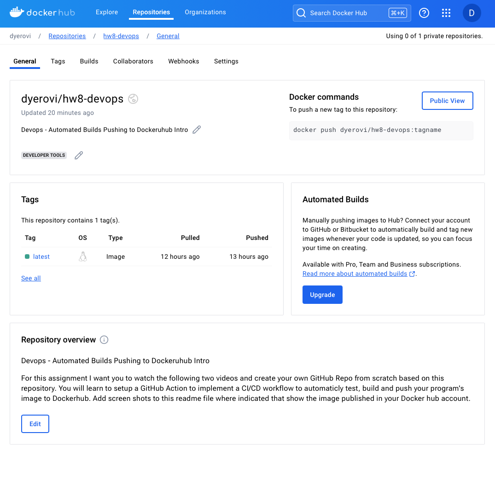
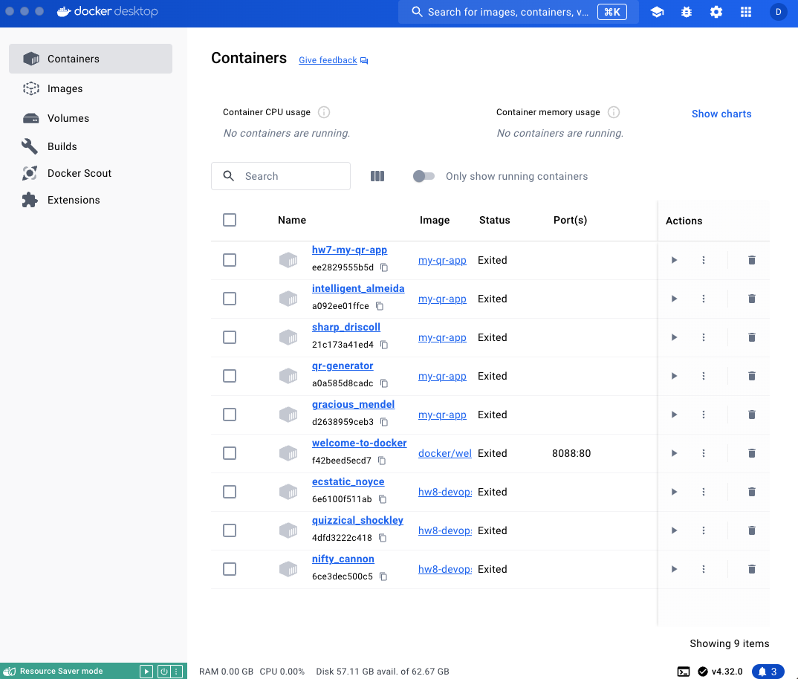
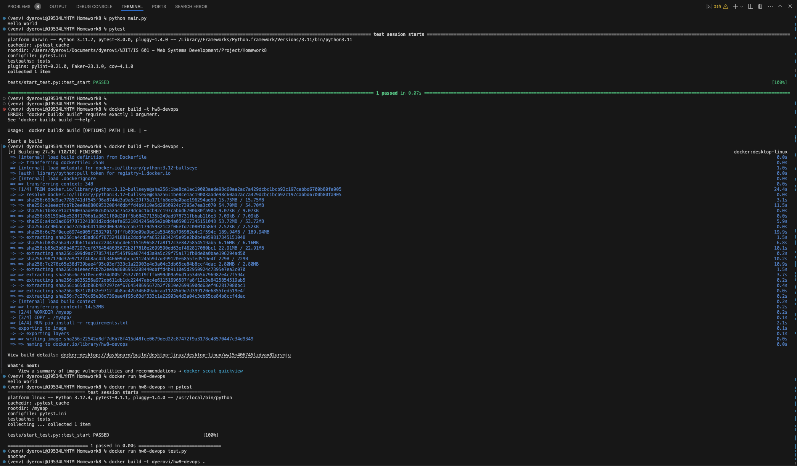

# Devops - Automated Builds Pushing to Dockeruhub Intro

For this assignment I want you to watch the following two videos and create your own GitHub Repo from scratch based on this repository.   You will learn to setup a GitHub Action to implement a CI/CD workflow to automaticly test, build and push your program's image to Dockerhub.  Add screen shots to this readme file where indicated that show the image published in your Docker hub account. 

## Screenshots

#### Screenshot of Docker account here.

#### Screenshot of Docker Desktop Containers List here.

#### Screenshot of Terminal screenshot creating image and passing pytest.

## Usage
**Setup Instructions**
--------------------

1. Clone the repository: `git clone https://github.com/d-yerovi/hw8-devops.git`
2. Install the required packages: `pip install -r requirements.txt`
3. Create and activate the virtual environment (VE).
    * Create - `virtualenv venv` or `virtualenv -p python3`
    * Activate - `source venv/bin/activate`
    * Deactivate - `deactivate` 

## List of few commads used on this mini project

1. `docker build -t hw8-devops .`
   ### Builds a Docker image with the tag "hw8-devops" from the current directory (denoted by the dot at the end).

2. `docker run -it hw8-devops`
   ### Runs a new container from the "hw8-devops" image in interactive mode (-it flag). This allows you to access the container's shell.

3. `docker run -it hw8-devops python3 -m pytest`
   ### Runs a new container from the "hw8-devops" image, and executes the command "python3 -m pytest" inside the container. This runs the Pytest testing framework.

4. `docker run -it hw8-devops python3 -m pytest -v`
   ### Same as command 3, but with the added "-v" flag, which increases the verbosity of the Pytest output.

5. `docker run -it hw8-devops python3 -m pytest -v --cov`
   ### Same as command 4, but with the added "--cov" flag, which enables code coverage analysis using the coverage.py library.

6. `docker run hw8-devops test.py`
   ### Runs a new container from the "hw8-devops" image, and executes the command "test.py" inside the container. This likely runs a Python script named "test.py".

7. `docker build -t dyerovi/hw8-devops .`
   ### Builds a Docker image with the tag "dyerovi/hw8-devops" from the current directory. The "dyerovi/" prefix suggests this image will be pushed to a Docker Hub repository owned by "dyerovi".

8. `docker push dyerovi/hw8-devops`
   ### Pushes the "dyerovi/hw8-devops" image to the Docker Hub repository.

9. `docker run -it dyerovi/hw8-devops python3 -m pytest`
   ### Runs a new container from the "dyerovi/hw8-devops" image, and executes the command "python3 -m pytest" inside the container. This runs the Pytest testing framework.
